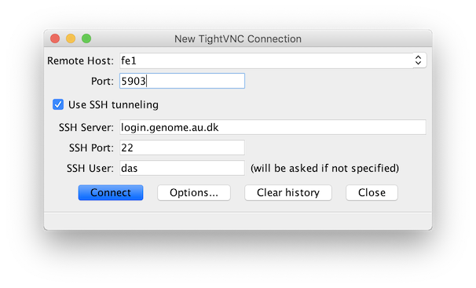

.. _getting_started:

===============
Getting started
===============

.. admonition:: iPSYCH...

    For security reasons, iPSYCH users are working in a restricted environment.
    In some cases, this means that iPSYCH users must use special commands or
    follow special instructions for certain things. This will be noted in red
    boxes like this one throughout the documentation.

How does the cluster work?
==========================

A cluster consists of a large number of interconnected machines. Each machine
is very much like your own desktop computer, except it's much more powerful
and is optimized for specific workloads. However, like your desktop computer,
each machine (often referred to as *node*) has a CPU, some memory, and a hard
disk. The nodes running your programs are usually called *compute nodes*.

To turn the separate nodes in to a cluster we need three more ingredients: a
network connecting the nodes, data storage, and a queue manager. In
section we'll discuss these components in a bit more detail, to give you an
understanding of how a cluster works and how to utilize it properly.

Components of the cluster
-------------------------

Our cluster is connected through a high-performance network which
allows all of the nodes to "talk" to each other. This allows programs running
on one node to communicate with programs running on another node.

The compute nodes allow us to compute things and the network allows us to
communicate between nodes. However, we also need access to data. This is the
task of the storage system. Since bioinformatics is extremely data intensive we
can't make do with a single hard disk as you would in your own computer.
Instead we buy hundreds of hard disks and use a file system that can manage
files across all of these disks and present the user with one, united file
structure, as most users expect. In our case, this storage system is known as
*fast storage* since the distributed nature of the system also makes it very,
very fast. Files that are not put on the fast storage system are instead placed
on a normal, slow shared file system.

With storage the system is now functional. However, any user would be able to
log in to any node and start running a program, which may consume the resources
of the entire node, potentially causing other peoples' programs to crash.
Similarly, one user would be able to start thousands of runs of a program on
different nodes, consuming the resources of the entire cluster for an unknown
duration of time. In short, it would be complete anarchy!

To solve this problem we need the final component of the cluster, the *queue
manager*. The queue manager is much like the queues in the supermarket. You
stand in the queue and wait until it's your turn to pay. On the cluster, you
submit *jobs* to the queue, and your jobs will then be run on some node chosen
by the queue manager, once resources are available. The queue manager also
allows you to specify certain requirements for your program to run. For
example, your program may need to run on a node with *a lot* of memory. If you
specify this when submitting your job, the queue manager will make sure to run
the job on a node with at least that amount of memory available. At GenomeDK
we use a queue manager called SLURM, so to run your programs on the cluster,
you'll be interacting a lot with SLURM.

Things to remember...
---------------------

This ends our tour of the cluster setup. Now, here's a few things that you
should keep in mind when using the cluster...

* The nodes in a cluster are set up so that they're all (more or less)
  identical. This means that software that is available on one node will also
  be available on all other nodes, that your user account exists on all nodes,
  and that you can access your files in the same way on all nodes. When the
  queue manager runs your job in a node, it more or less corresponds to you
  logging in to the node and running the program yourself.

* A cluster is accessed through a single node, often denoted the *frontend*.
  The frontend node is in many ways identical to all of the other nodes, but it
  is set up to allow access from the Internet. Your day-to-day interaction with
  the cluster thus goes through the frontend. However, you should *not* run any
  computation or memory intensive programs on the frontend. All users share the
  frontend's resources and thus it should mainly be used for basics things like
  looking around the file system, writing scripts, and submitting jobs.

In the next section you will learn how to connect to the cluster, which
essentially means getting access to the frontend node, so that you can start
submitting jobs.

Get access to the cluster
=========================

.. admonition:: iPSYCH...

    Fill out the form for `iPSYCH users`_.

Fill out the form for `normal users`_.

Once you've been granted access, you'll receive an e-mail with your password.
You'll then be able to connect to the cluster.

.. _normal users: https://genomedk.wufoo.com/forms/request-access-to-cluster/
.. _iPSYCH users: https://genomedk.wufoo.com/forms/request-access-to-cluster-ipsych-only/

Connecting to the cluster
=========================

.. admonition:: iPSYCH...

    Follow the instructions `here <http://ipsych.genome.au.dk/>`_.

SSH [Linux/macOS]
-----------------

On Linux, open the terminal of your choice. On macOS, you may use
:program:`Terminal.app` which can be found in the
:file:`/Applications/Utilities` folder. In both cases, you should now be able
to log in to the frontend by typing this command:

.. code-block:: console

    [local]$ ssh USERNAME@login.genome.au.dk

.. todo::

    MobaXterm [Windows]
    -------------------

    On Windows, download and install the `MobaXterm`_ application following the
    instructions on the website.

    .. _MobaXterm: https://mobaxterm.mobatek.net/

Changing your password
======================

This is important! Since e-mail is not secure, someone may get access to the
password that we sent to you. Thus, you should change it immediately after
logging in. Run the command:

.. code-block:: console

    [fe1]$ change-password

It will ask you for your current password, then ask what your new password
should be. Finally, it will ask you to confirm your new password by typing it
again.

.. warning::

    Do not use :program:`passwd`, :program:`yppasswd` or
    :program:`ipsych-passwd` to change your password. These commands won't
    work in all cases or at all.

.. todo::

    Two-factor authentication
    =========================

    * FreeOTP (recommended)
    * NetIQ Advanced Authentication
    * Google Authenticator

Public-key authentication
=========================

A public-key setup is a way to be able to access one computer from another
computer securely, but without typing a password every time you want to log in.
This is practical if you often log in to the frontend of the cluster. However,
we can also use a public-key setup to allow you to access any compute node on
the cluster from the frontend without typing your password every time. This is
especially handy when you're debugging a problem on the compute nodes.

.. todo::

    Note that for security reasons we require that you either (1) log in with
    a password and two-factor authentication (2) log in with public-key
    authentication

Here, we will first set up a public key for accessing the frontend. Then, we'll
set up a key for accessing compute nodes from the frontend.

ssh-keygen [Linux/macOS]
------------------------

On your own computer, open the terminal of your choice and type:

.. code-block:: console

    [local]$ ssh-keygen

You'll be asked several questions. The defaults are just fine, so just press
the :kbd:`Enter` for all of them. Make sure to leave the passphrase empty!

The output should look similar to this:

.. code-block:: console
    :emphasize-lines: 6

    Generating public/private rsa key pair.
    Enter file in which to save the key (/Users/das/.ssh/id_rsa):
    Enter passphrase (empty for no passphrase):
    Enter same passphrase again:
    Your identification has been saved in /Users/das/.ssh/id_rsa.
    Your public key has been saved in /Users/das/.ssh/id_rsa.pub.
    The key fingerprint is:
    SHA256:XxSd35yPd1bUoIJQDBCAvxDu+pB25ipYpcmp+VEh5JE das@jorn
    The key's randomart image is:
    +---[RSA 2048]----+
    | .+oooo+.   ...o.|
    |ooE.   ...   oo o|
    |.oo .   . . o  +o|
    |......     o   .=|
    |.o *.   S   .  .o|
    | oB.     . .  . =|
    |==.o      .    o.|
    |B.+.             |
    |.++.             |
    +----[SHA256]-----+

Note the path of the public key (on the highlighted line). To copy the public
key to the cluster, run:

.. code-block:: console

    [local]$ ssh-copy-id -i PUBLIC-KEY-PATH login.genome.au.dk

Replace *PUBLIC-KEY-PATH* with the path to your public key. You will be asked
to enter your password for the cluster. You should now be able to log in to the
cluster without typing your password. Test this by runnning:

.. code-block:: console

    [local]$ ssh USERNAME@login.genome.au.dk

You should not be prompted for a password.

Now, set up public-key access to all compute nodes. On the frontend, run the
same :command:`ssh-keygen` command as before:

.. code-block:: console

    [fe1]$ ssh-keygen

Again, just press :kbd:`Enter` to use the default values (and do not type in a
password). Then run:

.. code-block:: console

    [fe1]$ cat ~/.ssh/id_rsa.pub >> authorized_keys

You will now be able to SSH between compute nodes without typing a password.

.. todo::

    MobaXterm [Windows]
    -------------------

.. _mounting:

Accessing your files locally
============================

You can access your files on GenomeDK locally by a process called *mounting*.
Mounting the GenomeDK filesystem locally makes it possible to access and edit
your files as if they were located in a folder on your own harddrive.

sshfs [Linux/macOS]
-------------------

* On distros with the :program:`apt` package manager (Ubuntu, Mint etc.):

  .. code-block:: console

      [local]$ apt-get install sshfs

* On distros with the :program:`yum` package manager (Fedora, CentOS etc.):

  .. code-block:: console

      [local]$ yum install sshfs

* On macOS, download and install the *SSHFS* and *FUSE for macOS* packages
  from the `OSX FUSE`_ website.

Create a directory where the filesystem will be mounted:

.. code-block:: console

    [local]$ mkdir ~/GenomeDK

Now mount the filesystem by running this command:

.. code-block:: console

    [local]$ sshfs USERNAME@login.genome.au.dk:/home/USERNAME ~/GenomeDK \
        -o idmap=none -o uid=$(id -u),gid=$(id -g) \
        -o allow_other -o umask=077 -o follow_symlinks

Where *USERNAME* should be replaced with your GenomeDK username. You should
now be able to access your files on GenomeDK by going to the ``~/GenomeDK``
directory on your computer.

To unmount the directory, run:

.. code-block:: console

    [local]$ umount ~/GenomeDK

.. _OSX FUSE: https://osxfuse.github.io/

.. todo::

    Win-SSHFS [Windows]
    -------------------

Encrypting sensitive data
=========================

If you need to transfer sensitive data (for example human genomes) out of the
cluster you must encrypt the data first. Encrypting the data makes it
impossible for strangers to look at it without decrypting it, which requires
a password chosen by you.

Encrypt:

.. code-block:: console

    [fe1]$ openssl aes-256-cbc -a -salt -in data.txt -out data.txt.enc

This will encrypt ``data.txt`` and write the encrypted data to
``data.txt.enc``. You will be prompted for a password which is needed to
decrypt the file again.

Decrypt:

.. code-block:: console

    [fe1]$ openssl aes-256-cbc -d -a -in data.txt.enc -out data.txt.new

This will ask for the password used to encrypt the file. The decrypted contents
are written to ``data.txt.new``.

Copying data
============

.. admonition:: iPSYCH...

    To copy data from the cluster, see :ref:`ipsych-export`
    To copy data to the cluster, see :ref:`ipsych-import`

From your own machine to/from the cluster
-----------------------------------------

If you :ref:`mounted <mounting>` GenomeDK on your computer, you can copy files
to and from the cluster by simple drag-and-drop. Otherwise you can use one of
the solutions listed here or one of these alternatives:

* Filezilla_ [Linux/macOS/Windows]
* Cyberduck_ [macOS]
* WinSCP_ [Windows]

scp/rsync [Linux/macOS]
~~~~~~~~~~~~~~~~~~~~~~~

To copy a single file from your computer to the cluster:

.. code-block:: console

    [local]$ scp myfile.txt login.genome.au.dk:path/to/destination/

To copy a single file from the cluster to your computer:

.. code-block:: console

    [local]$ scp login.genome.au.dk:/path/to/file .

If you want to copy an entire folder to/from the cluster you will want to use
:program:`rsync` instead. To copy a folder from your computer to the cluster:

.. code-block:: console

    [local]$ rsync -e ssh -avz /path/to/data user@login.genome.au.dk:data

If you want to upload a folder, but also delete files that you deleted in the
source folder from the destination:

.. code-block:: console

    [local]$ rsync -e ssh -avz --delete /path/to/data user@login.genome.au.dk:data

If you want to download data from the cluster:

.. code-block:: console

    [local]$ rsync -e ssh -avz --delete /location/data user@login.genome.au.dk:data

You may want to add the ``--progress`` flag to all of these commands if you're
downloading/uploading large amounts of data.

.. todo::

    MobaXterm [Windows]
    ~~~~~~~~~~~~~~~~~~~

.. _Filezilla: https://filezilla-project.org/
.. _Cyberduck: https://cyberduck.io/
.. _WinSCP: https://winscp.net/eng/index.php

From the Internet to the cluster
--------------------------------

You can use :program:`wget` to download data from the Internet to the cluster:

.. code-block:: console

    [fe1]$ wget -c --timeout=120 --waitretry=60 \
        --tries=10000 --retry-connrefused URL

Remember to replace ``URL`` with the thing you want to download.

When downloading large files you are encouraged to limit the progress output to
avoid stressing the system, *especially* when you're sending the progress
output to a file:

.. code-block:: console

    [fe1]$ wget -c --progress=giga:force --timeout=120 --waitretry=60 \
        --tries=10000 --retry-connrefused URL

Collaborating on data
=====================

Data sharing between users can only be accomplished through dedicated project
folders to which only certain users have access. To apply for a project folder,
fill out `this <https://genomedk.wufoo.com/forms/request-new-project-group>`_
form.

When your request has been accepted, you and the other project members will
have access to a shared folder in :file:`/project/PROJECT-NAME` where
*PROJECT-NAME* is the name requested for your project. All users can add, edit,
and delete files in the project folder unless restrictions have been set on
specific files/folders.

Backing up data
===============

We provide backup on good old-fashioned tape to all users. To back up a file,
it should be put in a directory called either ``BACKUP``, ``Backup`` or
``backup``. The directory can be located in any other directory.

Data is backed up approximately once per week.

.. warning::

    Do not back up temporary data files that can easily be reproduced.
    Computation is cheap, but backup is *very* expensive. The backup is meant
    for scripts/source code and important raw data.

Using graphical interfaces
==========================

There's two options for using programs with a graphical user interface on
GenomeDK.

.. _xforwarding:

X-forwarding [Linux, macOS, Windows]
------------------------------------

You can use X-forwarding to tunnel individual graphical programs to your local
desktop. This works well for many programs, but programs that do fancy graphics
or anything animated might not work well.

Xorg [Linux]
~~~~~~~~~~~~

Since most Linux distributions already include an X server, you simply need to
tell SSH that you wish to enable X-forwaring. To do this, add ``-X`` to the
:program:`ssh` command when logging in to the cluster, for example:

.. code-block:: console

    [local]$ ssh -X USERNAME@login.genome.au.dk

You should then be able to open e.g. Firefox on the frontend:

.. code-block:: console

    [fe1]$ firefox

XQuartz [macOS]
~~~~~~~~~~~~~~~

Since macOS does not include an X server, you will need to download and install
XQuartz_ on your computer. When installed, reboot the computer. Now, you just
need to tell SSH that you wish to enable X-forwarding. To do this, add ``-X``
to the :program:`ssh` command when logging in to the cluster, for example:

.. code-block:: console

    [local]$ ssh -X USERNAME@login.genome.au.dk

You should then be able to open e.g. Firefox on the frontend:

.. code-block:: console

    [fe1]$ firefox

.. _XQuartz: https://www.xquartz.org/

.. todo::

    MobaXterm [Windows]
    ~~~~~~~~~~~~~~~~~~~

VNC [Linux/macOS/Windows]
-------------------------

If you want to use a full virtual desktop you can use a VNC program. There are
lots of options but we recommend TightVNC_ which works on both Linux, macOS,
and Windows. When downloading TightVNC we recommend to get "TightVNC Java Viewer"
from the download section. It downloads a zip archive which contains an executable
jar file.

To use VNC you first need to login to the frontend and start a *VNC server*.
Starting the server is done with the ``vncserver`` command and looks like this:

.. code-block:: console
    :emphasize-lines: 8

    [fe1]$ vncserver

    You will require a password to access your desktops.

    Password:
    Verify:

    New 'fe1.genomedk.net:3 (user)' desktop is fe1.genomedk.net:3

    Creating default startup script /home/user/.vnc/xstartup
    Starting applications specified in /home/user/.vnc/xstartup
    Log file is /home/user/.vnc/fe1.genomedk.net:3.log

The display id (``:3`` in this example) is needed when you want to connect
the VNC client.

To connect to the running VNC server the SSH tunnel through the login node has
to be established. In case of TightVNC, the tunneling option is included in the
software itself and following settings should be sufficient:

Note the "Port" field! The number specified must be 5900 plus the display ID,
which in this example was :3. Thus, the port number becomes 5903.

.. _TightVNC: https://www.tightvnc.com/

Editing files
=============

If you :ref:`mounted <mounting>` GenomeDK on your computer, you can edit files
directly by just opening them with your prefered text editor on your computer.
Otherwise you can use one of the solutions listed here.

Nano, vim, emacs
----------------

With editors like :program:`nano`, :program:`vim` and :program:`emacs` you can
edit files directly on the cluster. The editor itself also runs on the cluster
and thus your editor settings etc. are conserved, even if you log in from
another computer. Also, these editors don't require a graphical user interface,
so you don't need X-forwarding or VNC.

The :program:`nano` editor is by far the simplest editor of three, but also the
least powerful. However, it's just fine for quickly editing scripts or looking
at output files. The documentation for :program:`nano` can be reached by
running the command:

.. code-block:: console

    [fe1]$ man nano

You can open :program:`nano` by running:

.. code-block:: console

    [fe1]$ nano name-of-file.txt

Likewise, `vim`_ and `emacs`_ are already installed on the cluster.
Documentation for each editor can be found on their respective websites.

.. _vim: https://www.vim.org/
.. _emacs: https://www.gnu.org/software/emacs/index.html

Gedit with X-forwarding
-----------------------

If you want a graphical user interface and a more familiar editing experience,
you may use the :program:`Gedit` editor with :ref:`X-forwarding <xforwarding>`.
Make sure that you are connected to the cluster with X-forwarding enabled. Then
run:

.. code-block:: console

    [fe1]$ gedit

This will open the :program:`Gedit` editor in a new window. Since the editor
runs on the frontend, you have access to all of your files on the cluster.

Interacting with the queue
==========================

Since GenomeDK is a shared system, all computations must be carried out through
a queue. Users submit jobs to the queue and the jobs then run when it's their
turn. To cater for different workloads, jobs can be submitted to one or more
*partitions*, which are essentially queues that have been assigned certain
restrictions such as the maximum running time.

The queueing system used at GenomeDK is Slurm_. Users that are familiar with
Sun Grid Engine (SGE) or Portable Batch System (PBS), will find Slurm very
familiar.

.. note::

    A node can be shared by more users, so you should always take extra care in
    requesting to correct amount of resources (nodes, cores and memory). There
    is no reason to occupy an entire node if you are only using a single core
    and a few gigabytes of memory. Always make sure to utillize the resources
    on the requested nodes efficiently.

To get an overview of the available partitions:

.. code-block:: console

    [fe1]$ gnodes

This will list each partition and all of the compute nodes assigned to each
partition. The header of each partitions lists the available resources such as
the number of cores per node, available memory per node, and the maximum
walltime (running time) a job in the partition can have.

The queueing system allows us to either submit an *interactive* or *batch* job.
An interactive job effectively gives you a shell on a compute node so that you
can type commands and run programs that will run on that node. This is great
for experimenting and debugging problems.

Interactive jobs
----------------

To submit an interactive job:

.. code-block:: console

    [fe1]$ srun --pty /bin/bash
    srun: job 17129453 queued and waiting for resources
    srun: job 17129453 has been allocated resources
    [s03n73]$

This may take some time since you must wait until it's your turn in the queue.
Once it's your turn, you'll get a shell on the node that was assigned to you.
In this case, we were given the node *s03n73*.

You may also specify some requirements for the job, such as the amount of
memory that should be allocated:

.. code-block:: console

    [fe1]$ srun --mem=16g --pty /bin/bash

When running a job you have access to the same filesystems as when running on
the frontend. Thus, you can access your home folder and project folders with
the same paths as on *fe1*.

When you're done with your interactive session on the node, it can be exited
by running the ``exit`` command or pressing :kbd:`Control + D`.

.. code-block:: console

        [s03n73]$ exit
        [fe1]$

You'll now be back on the frontend.

Batch jobs
----------

While interactive jobs are useful, they require you to be logged in to the node
while your computations one the node are running. Exiting the session will
cancel your computations, which is not usually what you want. Also, you may
want to run many jobs on multiple nodes, and having that many interactive
sessions open quickly becomes unmanagable.

To solve this, we may submit a *batch* job instead. Batch jobs are submitted to
the queue like interactive jobs, but they don't give you a shell to run
commands. Instead, you must write a *job script* which contains the commands
that needs to be run.

A job script looks like this:

.. code-block:: shell

    #!/bin/bash
    #SBATCH --partition normal
    #SBATCH --mem-per-cpu 4G
    #SBATCH -c 1

    echo hello world > result.txt

The job script specifies which resources are needed as well as the commands to
be run. Line 2 specifies that this job should be submitted to the *normal*
partition. Line 3 specifies that we want 4G of memory per allocated core, and
line 4 specifies that we want a single core to run on. See the table below for
an overview of commonly used resource flags:

.. csv-table:: Resource flags
    :header: "Short flag", "Long flag", "Description"
    :align: left

    "``-p``", "``--partition``", "One or more comma-separated partitions that the job may run on. Jobs submitted to the *gpu* partition should also use the *--gres* flag."
    "", "``--mem-per-cpu``", "Memory allocated per allocated CPU core."
    "``-c``", "``--cpus-per-task``", "Number of cores allocated for the job."
    "``-t``", "``--time``", "Maximum time the job will be allowed to run."
    "", "``--gres=gpu:<number of gpu's>``", "Number of GPU cards to be used in case the job is being submitted to the *gpu* partition. If not defined the job will not have access to GPU cards, even if it is running on a proper node."

The rest of the script is a normal Bash_ script which contains the commands
that should be executed, when the job is started by Slurm.

To submit a job for this script, save it to a file (e.g. :file:`example.sh`)
and run:

.. code-block:: console

    [fe1]$ sbatch example.sh
    Submitted batch job 17129500
    [fe1]$

Contrary to :command:`srun`, this command returns immediately, giving us a job
id to identify our job.

Working on GPU nodes
--------------------

There are currently 2 compute nodes on the cluster that are equipped with GPU cards with
two devices per node. There are currently no frontends equipped with GPU devices.

If you need to compile a piece of software that is supposed to use GPU’s you most likely
have to do it in a job on one of the compute nodes with such devices, since headers required
for compilation are only located there.

Headers and libraries for compilation are located in */usr/local/cuda/targets/x86_64-linux*

To to run a job on a node with a GPU device you need to submit it to the *gpu*
partition and specify how many GPU devices you are going to use, for example to
submit an interactive job that will use just one GPU:

.. code-block:: console

    [fe1]$ srun --gres=gpu:1 -p gpu --pty /bin/bash

Checking job status
-------------------

To check the status of a job:

.. code-block:: console

    [fe1]$ jobinfo 17129500

To check the status of all of your submitted jobs:

.. code-block:: console

    [fe1]$ squeue -u USERNAME

You can also omit the username flag to get an overview of all jobs that have
been submitted to the queue:

.. code-block:: console

    [fe1]$ squeue

Cancelling a job
----------------

Jobs can be cancelled using the :program:`scancel` command:

.. code-block:: console

    [fe1]$ scancel 17129500

Checking job priorities
-----------------------

You may be wondering why one of your jobs are not starting. It may be due to
other jobs having a higher priority. To see the priority of all jobs in the
queue:

.. code-block:: console

    [fe1]$ priority -a

Extra credit
------------

Most people find it annoying to write these job script for each step in their
workflows and instead use a workflow engine such as gwf_ (developed at
GenomeDK) or snakemake_ (quite popular in bioinformatics). Such tools allow you
to write entire pipelines consisting of thousands of separate jobs and submit
those jobs to Slurm without writing job scripts.

.. _Slurm: https://slurm.schedmd.com/
.. _Bash: https://www.gnu.org/software/bash/manual/bash.html
.. _gwf: https://docs.gwf.app/en/latest/
.. _snakemake: https://snakemake.readthedocs.io/

.. _installing_and_using_software:

Installing and using software
=============================

.. seealso::

    If you're an "old" user of GenomeDK, read the :ref:`transition` section
    for instructions on transitioning away from :file:`/com/extra`.

We recommend that you install and use the `Conda`_ package manager to install
software on GenomeDK.

Downloading and installing Conda is very simple, you just download and run the
installer:

.. code-block:: console

   [fe1]$ wget https://repo.continuum.io/miniconda/Miniconda3-latest-Linux-x86_64.sh
   [fe1]$ chmod +x Miniconda3-latest-Linux-x86_64.sh
   [fe1]$ ./Miniconda3-latest-Linux-x86_64.sh -b
   [fe1]$ echo ". /home/$(whoami)/miniconda3/etc/profile.d/conda.sh" >> .bashrc

Conda can install packages from different *channels*. This is similar to
*repositories* in other package managers. Here we'll add a few channels that
are commonly used in bioinformatics:

.. code-block:: console

    [fe1]$ conda config --add channels defaults
    [fe1]$ conda config --add channels conda-forge
    [fe1]$ conda config --add channels bioconda
    [fe1]$ conda config --add channels genomedk

The clever thing about Conda is that it allows you to use separate environments
for separate projects. If you have a project where you've installed a bunch
packages for Python or R there is no reason for those to accidentally seep in
to your next project. If you want to try different versions of some package you
can just create separate environments for them instead of installing and
uninstalling multiple times. With separate environments you force yourself to
make the dependencies for each project explicit which in turn makes it easier
for collaborators to run your code and improves reproducibility.

When you just installed Conda, it comes with a single environment known as the
*base* environment. To activate the base environment, just type:

.. code-block:: console

    [fe1]$ conda activate
    (base) [fe1]$

You now have access to the software installed in the base environment.

Here is how the usage might look if we want to create a new environment with
the newest version of `PySAM`_:

.. literalinclude:: examples/conda-create-env
    :language: console

This gives us a clean environment with just the minimal number of packages
necessary to support PySAM. To use the software that was installed in the
environment, the environment needs to be activated first:

.. code-block:: console

    [fe1]$ conda activate amazing-project
    (amazing-project) [fe1]$ python -c 'import pysam; print(pysam.__version__)'
    0.6.0

Notice that the prompt changed to show you that you're now in the
*amazing-project* environment.

Conda can install any kind of software. This means that your entire setup can
be installed through Conda (if there's packages for it all). For example,
you can create an environment with Rstudio, R, and ggplot2 with a single
command. You can search for packages at anaconda.org_.

To install software in the currenctly activated environment:

.. code-block:: console

    (amazing-project) [fe1]$ conda install PACKAGE-NAME

To remove a software package from the currently activated environment:

.. code-block:: console

    (amazing-project) [fe1]$ conda remove PACKAGE-NAME

To update a software package in the currently activated environment:

.. code-block:: console

    (amazing-project) [fe1]$ conda update PACKAGE-NAME

Since Conda knows about the entire environment you created, it can tell you
exactly which packages are used in the environment. This is very useful for
collaborating with others, since your collaborators can create an exact copy
of your environment with a single command.

To export your environment so that others can recreate it:

.. code-block:: console

    (amazing-project) [fe1]$ conda env export > environment.yml

The :file:`environment.yml` file contains an exact specification of your
environment and the packages installed. You can put this in your shared project
folder. Others will then be able to recreate your environment by running:

.. code-block:: console

    [fe1]$ conda env create -f environment.yml

You can read more about using environments for projects
:ref:`here <project_specific_environments>`. There's also also a `cheat sheet`_
with Conda commands available.

.. _PySAM: http://pysam.readthedocs.io/en/stable/
.. _anaconda.org: https://anaconda.org/
.. _Conda: https://conda.io/docs/
.. _Anaconda: https://www.anaconda.com/download/
.. _cheat sheet: http://know.continuum.io/rs/387-XNW-688/images/conda-cheatsheet.pdf

.. _transition:

Transition to Conda
-------------------

Previously, GenomeDK has made software available for users through a special
mechanism called :file:`/com/extra` which allowed users to load specific
software packages. However, there are several problems with the approach taken
here. If you are already using software from :file:`/com/extra`, note that this
may not be supported in the future and that no new software will be made
available through this mechanism.

Also, note that software installed through the old mechanism may interfere with
your environments. If you wish to use Conda we therefore encourage you to edit
your :file:`.bashrc` and :file:`.bash_profile` files and remove all lines which
loads software from :file:`/com/extra`.

Additionally, you should ensure that none of the above files reference any
system Python installation or related modules. It's also a good idea to remove
any reference to :file:`/com/extra/stable`.
