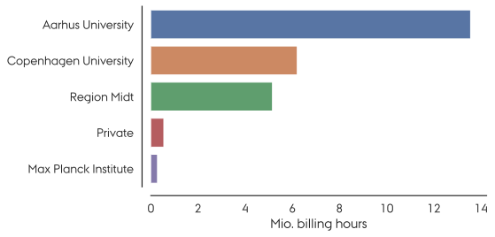
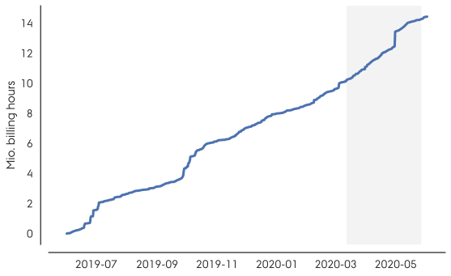

Hello!

It's time for the summer edition of your favourite newsletter! We've
had a strange spring where COVID-19 forced most of us to work from home.
However, that didn't stop you from using GenomeDK, as we'll see later.

<!-- more -->

We would like to feature **your** scientific work with GenomeDK in
future newsletters. If you'd like to write a few lines about your
research and how it's being supported by GenomeDK, please get in touch!

Enjoy!

*The GenomeDK Team*

# A few updates

## Major expansion of compute capacity

We recently added 3584 new cores, doubling our total compute capacity!
We're now at 6568 cores total. The new nodes went through a short
testing phase and have been performing extremely well. The new nodes are
2x AMD/\"EPYC Rome\" 7452 CPUs and 512 GB of memory.

## Goodbye to s01 and s02

We have now said a final goodbye to the s01 and s02 nodes, from the
first purchase eight years ago for GenomeDK.

## Moving home folders and projects

In the past year we have been working continuously to move home folders
and projects away from our old file servers. While a lot of data has
been moved so far, there's still a lot of data left. To speed up the
process and minimize downtime, we will move the remaining data without
an actual downtime.

-   When we move a home folder, we will lock the user out of the cluster
    while it's being moved. All other users will be able to work as
    normal. The affected user will be notified when the process is
    complete. To make this less annoying we will schedule moves of home
    folders to run during the night.
-   When we move a project folder, all project members will be locked
    out of the folder. The project owner will be notified when the
    process is complete. Since the projects that need to be moved are
    mostly old projects without much activity, this will be scheduled
    throughout the week.

## Keep track of your resources

It's always a good idea to keep track of your resource usage on
GenomeDK. We extended the `space` command so that it now has three
subcommands:

* `space user`: Show compute and storage numbers for a single user across projects and home folders. Useful for keeping track of your own resource usage.

* `space project <project name>`: Show compute and storage numbers for a given project. The resource usage of individual project members is shown. Useful for project owners that wish to identify which project members are using resources in the project.

* `space overview`: Show compute and storage numbers for all projects owned by you. This is primarly relevant for project owners.

To further increase awareness of the resources used on GenomeDK we will
also soon send out a monthly summary of your consumed billing hours and
storage usage.

# Some interesting facts

We're now up to **531 users**!

In the last year you used **26.3 million billing hours** (up from 18
million) distributed over **14.4 million jobs** (up from 12 million).

Our busiest day was on April 30th, 2020, where we handled **0.8 million
jobs**, which is 10 jobs per second on average!

If we look at the number of billing hours used, Copenhagen University is
now an even bigger player than last year and Region Midt is also doing
quite well.

<figure>

<figcaption>Top five organizations based on their compute usage (which
we measure in billing hours).</figcaption>
</figure>

The Coronavirus had a big impact on many parts of society, but
apparently not on the use of GenomeDK. The plot below shows the
cumulative number of billing hours used over the past year. The gray
area marks the period in which the university was shut down. Apart from
a single jump, it's pretty much business as usual.

<figure>

<figcaption>Cumulative billing hours over the past year. COVID-19 didn't
seem to make a significant impact on the productivity of our
users.</figcaption>
</figure>

We even hosted a workshop via Zoom during the shutdown!

# A few tips

-   We host workshops for your research group on request. A workshop can
    be tailored to your needs and previous experience with HPC. Read
    more about our workshops and see a list of previous workshops
    [here](@/help.md).

-   Do you want **faster and more stable** access to files in your home
    folder? We can now offer to move your NFS home folder to a new,
    faster, and more stable file server! To be moved the size of your
    home folder must be **less than 100 GB**. We encourage you to clean
    up your home folder, move big files to faststorage, and then contact
    us to have your user moved.

    To get the size of your home folder, run `space user`. This gives
    you a nice report of your disk usage.

-   Our software repository, `/com/extra` is **deprecated**. We won't
    add new software or update existing software in this repository.
    Instead, we encourage all users to use a proper package manager,
    like [Conda](@/docs/installing-software.md).

---

Thank you for reading!
