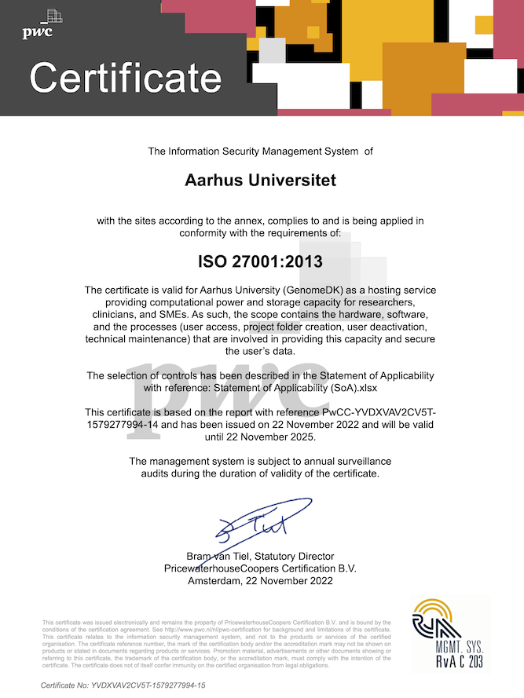
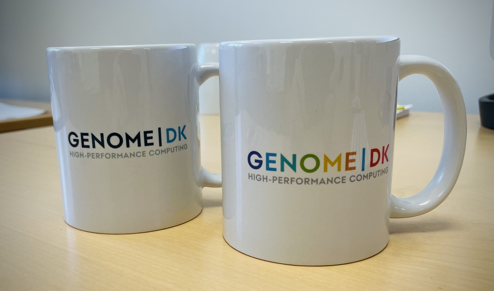

Hello!

We've entered the year 2023 and so it's time for another newsletter.

In 2022 we were happy to welcome 188 new users. 124 new projects were
created. You also all managed to spend 28 mio. billing hours spread over
15 mio. jobs!

<!-- more -->

At the time of writing we host 10344 TB of data and 1.066.060.678 files.
These numbers could have been much higher if it wasn't because we were
reaching max capacity on our storage systems. Thank you for cleaning up
your data!

# We're now ISO 27001-certified

The year 2022 was also the year where we received our ISO
27001-certification.

<figure>

<figcaption>ISO 27001 certificate from PwC.</figcaption>
</figure>

We hope that the certification means that you now feel even more
confident storing your data on GenomeDK. Naturally, as we're also the
first unit at AU to obtain such a certificate, it resulted in a bit of
media coverage:

-   <https://health.au.dk/display/artikel/har-du-brug-for-en-supercomputer>
-   <https://www.deic.dk/da/news/2023-1-26/genomedk-supercomputer-er-iso-27001-certificeret>

# Storage expansion in the works

A new storage expansion for GenomeDK is currently being installed. In
the coming weeks we will configure and tune the system for optimal
performance. After that, data will be migrated over several months. This
process will be transparent to our users.

<figure>

<figcaption>The new storage hardware being unloaded from the
truck.</figcaption>
</figure>

The new storage system has a total capacity of approximately 25 PB
(current capacity is 10.5 PB) and consists of more than 20 servers and
1500 disks. The system weighs approximately three tons.

# Mugs for all

Yes, you can now obtain a free, limited edition mug for your preferred
beverage featuring the GenomeDK logo! We have mugs featuring the
\"formal\" logo, but it's also still possible to get one featuring the
unique and eye-catching \"party\" logo.

<figure>

<figcaption>The brand new GenomeDK merchandise!</figcaption>
</figure>

Come by our office to get your mug!

# Unified management tools

We have unified our management tools. Previously, some tools had the
`gm` prefix, while more recent tools (like our data shares), used the
`gdk` prefix. All tools now have a `gdk` prefix and many tools have been
completely renamed to ensure more consistent naming.

This change makes it easy to discover which tools are available by
typing `gdk-<TAB>` in your terminal.

We also provide more tools, e.g. `gdk-project-list` for listing
projects, `gdk-project-usage` for detailed usage numbers, and
`gdk-export-list` for listing active exports

# Updated website

Our website has been revamped and the documentation reorganized.
Hopefully it's now easier to navigate and easier on the eye. We hope
you like it!

# Your responsibility

Finally, we urge you to stay up to date with your responsibilities
regarding hosting your data on GenomeDK by reading our
[terms of service](@/terms.md).

---

That's it for now. If you have any questions or comments, as always,
contact us at <support@genome.au.dk>.

Anders and Dan

**The GenomeDK Team**
