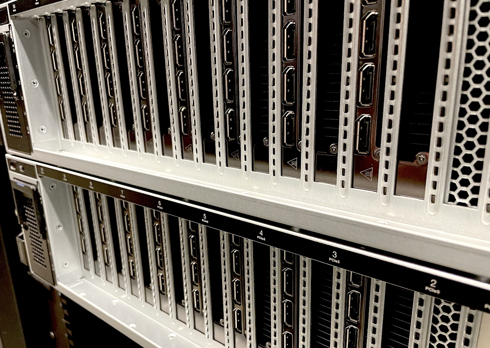

+++
title = "Newsletter, July 2024"

[extra]
published = false
highlight = true
illustration = "Sommer2017_Søauditorier_MY_2972.jpg"
+++

Summer is approaching (in a very wet fashion here in Aarhus) quickly and so it's time for another newsletter.

We are thrilled to welcome 175 new users to the GenomeDK community (so far) this year! Whether you're a researcher, student, academic clinician, or company, we are excited to support your data-driven endeavors, and wish you a very nice summer!

<!-- more -->

# News and announcements

## New GPU nodes now in production

We are excited to announce that we just this week expanded our computational capabilities with the addition of two new GPU nodes, each featuring 8 [Nvidia L40S GPUs](https://www.nvidia.com/en-us/data-center/l40s/), for a total of 16 GPUs! These nodes are designed to enhance performance for tasks requiring GPU-optimized computations, such as deep learning and AI.

<figure>

<figcaption>Front of the new GPU nodes. Each node has 8 Nvidia L40S GPUs. Although these are data center GPUs, each GPU has 4 HDMI ports, so you could actually connect a TV to these things!</figcaption>
</figure>

There's instructions for using the GPU nodes [in our documentation](@/docs/interacting-with-the-queue.md#gpu_nodes). Remember that compiling code for the GPU must also happen on one of the GPU nodes (in a job). The pricing is unchanged at 2.43 DKK/GPU billing hour.

These nodes will replace our current GPU nodes (two nodes with two Nvidia V100 16GB GPUs each).

## MOMA NGS Core Facility collaboration

The [MOMA NGS Core Facility](https://www.moma.dk/services/ngs-core-center) is a long-time collaborator of GenomeDK. A recent announcement from Institute of Biomedicine at Aarhus University, prohibits use of Chinese sequencing companies such as BGI. We therefore wish to highlight the [MOMA NGS Core Facility as an excellent local alternative](@/news/2024-06-25-moma-ngs-core-facility.md), with the option to have your data delivered directly to a project folder on GenomeDK.

## Notice: Long downtime in August

Please be aware that there will be an extended downtime period spanning August 18th and August 19th. The downtime is for essential maintenance to the data center electrical systems. We recommend planning your projects accordingly to minimize disruption. We will send out multiple reminders, but we advise you to put this in your calendar and watch our [status page](https://console.genome.au.dk/status/).

## New vendor: GlobalConnect

As you may know, GenomeDK runs its own backup solution for user data. With this solution the data is synchronized to and stored encrypted in separate, physically distant data centers, to ensure that the data is safe in case of a major disaster involving our main data center. For housing of the backup setups we now use the following vendors:

* [Incuba](https://incuba.dk/)
* [GlobalConnect (new)](https://globalconnect.dk/)

A project is only synchronized to one of these locations. If you wish to know which location your project has been allocated to, you're welcome to contact support.

Also, remember that [only data marked for backup is transferred to the backup](@/docs/working-with-data.md#backup).

# Good behavior

## Clean up and compress data

To maintain optimal performance and storage efficiency, please remember to clean up any unused or temporary data regularly. Additionally, compress your data whenever possible, especially large VCF files. This helps free up space and improves overall system performance.

## Avoid submitting short jobs

Please refrain from submitting jobs that run for less than 10 minutes. Such jobs can disrupt the queue and reduce system efficiency. Consider batching smaller tasks together into longer-running jobs by putting multiple commands in your batch script.

## Do not run on the frontend

Running computational tasks on the frontend nodes can severely impact the performance and stability of the system for all users. Always use the appropriate compute nodes for your jobs. If in doubt, consult the documentation on how to use the queuing system.

## Avoid writing data to disk if you can

We regularly see jobs that look like this:

```bash
bedtools coverage ... > output_file1
awk '{ print $1, $2 }' output_file1 > output_file2
grep something output_file2 > output_file3
rm output_file1
rm output_file2
```

While this works, it produces an excessive amount of temporary files and causes unnecessary load on the storage system. Instead, chain the commands with pipes:

```bash
bedtools coverage ... | \
awk '{ print $1, $2 }' | \
grep something output_file2 > output_file3
```

This will also run much faster as the temporary data stays in-memory instead of being written to disk.

# Tips and tricks

## Auto-magic Slurm account

When working within your project folder we now set the Slurm account automagically:

```bash
$ cd my_project_folder/
$ sbatch test.sh
123456
$ jobinfo 123456
Name                : test.sh
User                : das
Account             : my_project_folder
```

This works even if you're in a subfolder of the project folder. You can of course still override this behaviour using `sbatch --account <project name>`.

## Immediate error for jobs exceeding 7 days

You now get an error immediately when submitting a job if you set the time limit to more than 7 days:

```bash
[root@fe-open-02 ~]# srun --time 200:00:00 --pty bash
srun: error: lua: job time limit exceeds global time limit of 7 days and has been rejected
srun: error: cli_filter plugin terminated with error
```

Previously, the job would be submitted but never run, which could be quite puzzling to users.

---

Thank you for being a part of the GenomeDK community! As usual, if you have any questions or need assistance, please don't hesitate to contact our support team.

Best regards,

The GenomeDK Team

