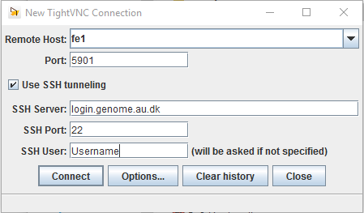

FAQ
===
Here are some frequently asked questions and general information you might need.

How do I change my password?
----------------------------
You can use the ``passwd`` command unless you are an iPSYCH user, in which case
you must use the ``ipsych-passwd`` command.

If you want a newly generated password you can use the `Request a new password`
form that can be found on genome.au.dk

Help! I have forgotten my password
----------------------------------
Use the `Request a new password` form that can be found on genome.au.dk

How do I get access to the installed software?
----------------------------------------------
Use /com/extra or manage your own stuff with conda

.. code-block:: console

    $ wget https://repo.continuum.io/miniconda/Miniconda3-latest-Linux-x86_64.sh
    $ chmod +x Miniconda3-latest-Linux-x86_64.sh
    $ ./Miniconda3-latest-Linux-x86_64.sh
    # Update PATH as it suggests
    $ conda config --set ssl_verify /com/etc/ssl-proxy-cert.pem

Log out and back in to make sure it still works (check with ``conda
--version``)

Now you can create environments blah blah blah

How do I make the shell remember more commands?
-----------------------------------------------
Add ``export HISTSIZE=100000`` to your ``.bash_profile``.

How do I access files on the cluster from my own machine?
---------------------------------------------------------
Many options:

* mount on linux/osx
* winscp on windows
* mobaxterm on windows
* filezilla sftp on all platforms
* CyberDuck on OS X
* rsync on OS X / Linux

TODO: Expand on each of these

Why does ssh ask for a password when I try and connect to compute nodes?
------------------------------------------------------------------------
Setup SSH to allow password-less login to compute nodes
TODO: Add text

How do I run graphical programs?
--------------------------------
X or vnc yadda yadda

**X-forwarding**

You can use X-forwarding to tunnel individual graphical programs to your local
desktop. This works well for many programs, but programs that do fancy graphics
or anything animated might not work well.

TODO: Add -X on linux
TODO: Install and use XQuartz on OS X
TODO (maybe): Xming + putty X-forwarding on windows?
TODO: MobaXterm also allows X-forwarding

**VNC**

If you want to use a full virtual desktop you can use a VNC program. There are
lots of options but we recommend TightVNC_.  It is a Java program that will
work on Linux, Windows and OS X.

To use VNC you first need to login to the frontend and start a *VNC server*.
Starting the server is done with the ``vncserver`` command and looks like this:

.. code-block:: console

    $ vncserver
    [user@fe1 ~]$ vncserver

    You will require a password to access your desktops.

    Password:
    Verify:

    New 'fe1.genomedk.net:3 (user)' desktop is fe1.genomedk.net:3

    Creating default startup script /home/user/.vnc/xstartup
    Starting applications specified in /home/user/.vnc/xstartup
    Log file is /home/user/.vnc/fe1.genomedk.net:3.log

    [aeh@fe1 ~]$ vncserver -list

    TigerVNC server sessions:

    X DISPLAY # PROCESS ID
    :3      27049a

The display id (``:3`` in this example) is needed when you want to connect
the VNC client.

TODO: What to put into TightVNC

To connect to the running VNC server the ssh tunnel through the login node has to established. In case of TightVNC tunneling option is included in the software it-self and following settings should be sufficient:

TODO: Screenshot of TightVNC settings

How do I run graphical programs from compute nodes?
---------------------------------------------------
Should work automatically if you can run them on the frontend

Why are my jobs waiting so long to start?
-----------------------------------------
Check ``gnodes`` and ``priority``
Check how many cores you are asking for
Check how much memory you are asing for
Check how much time you are asking for

How do I use RStudio?
---------------------
Make sure you have either X-forwarding or vnc going and then srun to allocate
some resources.

How do I use python/jupyter notebooks?
--------------------------------------
First you should either make sure you have your own conda setup or you should
be using the older one we have in ``/com/extra/Anaconda-Python/2.2.0-2.7/``.

Install the ``jupyter`` package in your environment and call the ``jupyter
notebook`` command.

How do I open images/pdfs?
--------------------------
Use ``eog`` for images and ``evince`` for pdf

I get an error when trying to install ``pip`` packages
------------------------------------------------------
You need to tell pip about the proxy we use and to trust its SSL certificate.
You can do this through the ``--cert`` option, like this:

.. code-block:: console

    $ pip --cert /com/etc/ssl-proxy-cert.pem install package-name

How can I avoid losing my session when I close my laptop?
---------------------------------------------------------
Use tmux/screen

I'm downloading a large file but it keeps failing, what can I do?
-----------------------------------------------------------------
Run in screen/tmux so you don't have to stay logged-in
Make wget auto-retry and continue from where it failed:

.. code-block:: console

    $ wget -c --timeout-120 --waitretry-60 --tries-10000 --retry-connrefused https://someurl.com/data.tar.gz

How do I prevent accidental changes to my important data?
---------------------------------------------------------
Put the data in a separate folder and do ``chmod -R a-w datafolder``.
Now you can't change, add or remove files in that folder hierarchy.

Why can't I connect?
--------------------
We only allow incoming connections from a whitelisted set of IPs, so if you get
a `connection refused` you should try sending us an email with the IP you are
connecting from. You can see what your IP is on http://myip.dk

We don't mind adding your home IP address but beware that it might change
frequently.  If you have a university VPN that might be more stable.

I have a collaborator that would like to upload some data, how do we do that?
-----------------------------------------------------------------------------
We have a special upload user so just send us their email and we will set them up.
Once the data is uploaded we will move it to a folder you have access to.

I am an iPSYCH user, how do I export files?
-------------------------------------------
If you have many files you should pack them up in a tar/zip.
Use ``ipsych-export`` on the file to be exported and then send an email to
Anders Børglum and CC us so we can see when he approves it.

I am an iPSYCH user, why is NoMachine acting up?
------------------------------------------------
We have seen cases where the keyboard (or just some buttons) stop working and
some other mysterious bugs like this.
You should try closing NoMachine completely (not just the window with the
current session) and reconnecting - if that doesn't work the only thing we can
do is to kill your session so shoot us an email if you need that.

I am used to PBS/Torque - how do I translate to slurm?
------------------------------------------------------
Link to pbs <-> slurm cheatsheet?
