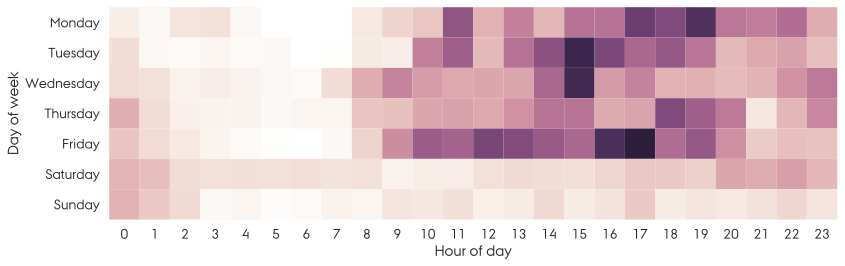

=======================
Newsletter, summer 2019
=======================

Hello!

We're quickly approaching summer vacation here in Denmark, so this is probably
a good time to take a look at the past year at GenomeDK.

We've collected numbers that demonstrate how we're growing, how the cluster is
used, and who the users are and where they come from.

We also have a few tips for you, as well as updates from the last year.

Enjoy!

A few updates
=============

Website and documentation
-------------------------

During the past year we've been working on improving our documentation and
website. The two sites have now been merged and live at the same domain,
`genome.au.dk <genome.au.dk>`_.

Most of the documentation has been rewritten and we tried hard to improve the
structure and make it easier for new users to get started.

We welcome all feedback on the new site!

Coming up, more storage!
------------------------

After manually pushing 840 hard drives into place we can seen increase our
storage to 12 PB! We will also be saying goodbye to some of our old storage
servers and will be migrating data from them to the new storage servers.

The new storage will be available as soon as the data migration and testing
has been completed.

We've got GPU nodes
-------------------

We recently added two GPU nodes with two GPUs each to GenomeDK. We encourage
you to experiment with these nodes. Several users have confirmed that they get
large speed-ups when running e.g. Tensorflow on the GPU nodes. You can read
more :ref:`here <gpu_nodes>`.

Some interesting facts
======================

Who uses GenomeDK?
------------------

In the last year we've welcomed approximately 80 new users to the cluster which
is now serving more than **400 people** from 17 countries.

    Countries with at least one GenomeDK user marked in red.

Although Aarhus University is by far the largest user of GenomeDK, we've seen
quite a bit of interest in GenomeDK from outside AU too. Actually, **47%** of
our users are not from AU. Many of these are, of course, your external
collaborators.

    Top five organizations based on the number of active user accounts.

How much compute is used?
-------------------------

In the last year you submitted **12 million jobs**, averaging
**33000 jobs per day**. Our most busy day was July 26th, 2018, where **390223
jobs were submitted in one day**!

We measure compute usage in units of *billing hours* which takes into account
the time a job was running, how many cores it allocated, and how much memory it
used.

In total you have used **18 million billing hours** in the last year.
We estimate that the cost of one billing hours is 0.12 DKK, so you collectively
burned through almost **2.2 million DKK** worth of compute time.

    Top five organizations based on their compute usage (which we measure in
    billing hours).

Region Midt is a substantial user due to research and clinical data analysis
from the Department of Molecular Medicine. Likewise, Copenhagen University
consumes a large chunk of our capacity.

How much storage is used?
-------------------------

Bioinformatics is data-intensive so storage is extremely important at GenomeDK.
There's currently **at least 4.8 PB data** stored on GenomeDK spread across
**370 million files**. Most of these files are tiny. In fact, 99% of files are
less than 26 MB. In the past year, the **biggest file on the cluster was
13.2 TB**.

The estimated cost of storing 1 TB of data for one year is 180 DKK. Thus, you
collectively **spent 864000 DKK** on data storage in the past year. If you had
to store this data in the cloud, for example on Microsoft Azure, you would pay
**18 mio. DKK... per month**!

.. figure:: top5_organizations_storage.svg

    Storage usage by organization. Aarhus University is of course at the top
    here, but has also been used GenomeDK for the longest time. Copenhagen
    University is a relatively new user and thus being number two in this plot
    shows that they've had explosive storage usage growth.

Let's look at some of the projects that call GenomeDK their home. First, here's
a list of the top five largest projects by the total size of the files in the
project.

.. table::
    :align: left

    +-----------------------+-----------------+
    | Project name          |    Size         |
    +=======================+=================+
    | DBS_Exomes            |        371 TB   |
    +-----------------------+-----------------+
    | DanishPanGenome2      |        329 TB   |
    +-----------------------+-----------------+
    | MammalianMutation     |        302 TB   |
    +-----------------------+-----------------+
    | RetroVirus            |        246 TB   |
    +-----------------------+-----------------+
    | MolGen                |        191 TB   |
    +-----------------------+-----------------+

That's a lot of data! But who then has the most files?

.. table::
    :align: left

    +-----------------------+-----------------+
    | Project name          | Number of files |
    +=======================+=================+
    | IGdata                |         68 mio. |
    +-----------------------+-----------------+
    | MammalianMutation     |         21 mio. |
    +-----------------------+-----------------+
    | MomaRAWfiles          |         21 mio. |
    +-----------------------+-----------------+
    | norfab                |         13 mio. |
    +-----------------------+-----------------+
    | NChain                |         13 mio. |
    +-----------------------+-----------------+

Almost **70 million files** for the winner, which is exactly the same as the
total number of files for number 2, 3, 4, and 5.

When are you active?
--------------------

The heat map below shows job submissions from the past year grouped by day of
the week and hour of the day.

    Activity map of job submissions. A darker color means more jobs were
    submitted.

GenomeDK users are clearly not morning people, but prefer to work late. There's
usually a lot of activity on Tuesday, Wednesday, and Friday afternoons. We're
also happy to observe that most users actually seem to take time off during the
weekend!

A few tips
==========

* Do you want **faster and more stable** access to files in your home folder?
  We can now offer to move your NFS home folder to a new, faster, and more
  stable file server! To be moved the size of your home folder must be **less
  than 100 GB**. We encourage you to clean up your home folder, move big files
  to faststorage, and then contact us to have your user moved.

  To get the size of your home folder, run ``space``. This gives you a nice
  report of your disk usage.

* Our software repository, ``/com/extra`` is deprecated. We won't add new
  software or update existing software in this repository. Instead, we
  encourage all users to use a proper package manager, like
  :ref:`Conda <installing_and_using_software>`.

---

Thank you for reading!
